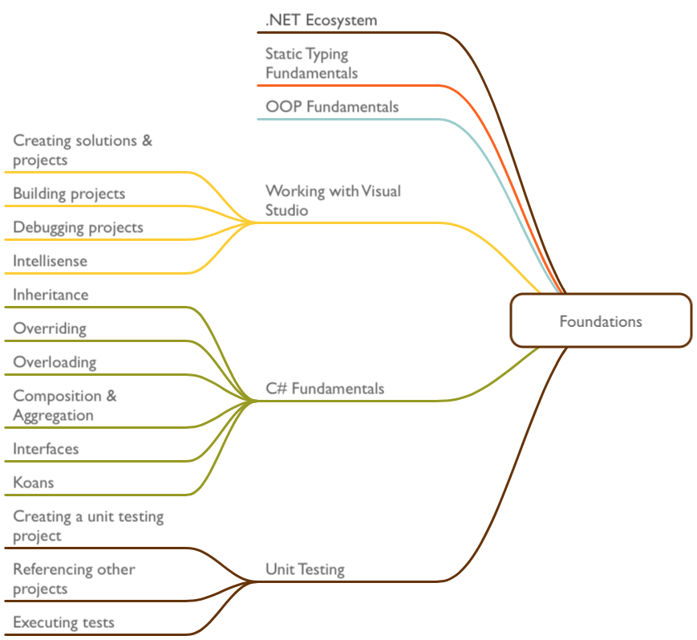

# Foundations of C\# Language and .NET Framework

## What is C\#?

A strongly typed, object oriented via classes, declarative and functional language in the .NET ecosystem that runs on the Common Language Runtime (CLR).

## What is .NET and the CLR?

## Installs

+ Install [Visual Studio Community Edition](https://www.visualstudio.com/en-us/products/visual-studio-community-vs.aspx) which will be your coding environment while working with C# and .NET.

+ Visit the [SQL Server Express 2014](https://www.microsoft.com/en-us/download/details.aspx?id=35579) page, click the download button and select the  `SQLEXPR_x64_ENU.exe` and the `	
SQLManagementStudio_x64_ENU.exe` which installs the SQL Server Mangement Studio.