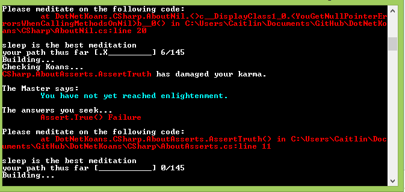

## DotNetKoans Exercise
This exercise walks you through major concepts in C# and dotnet while introducing you to basic testing by  having you complete small steps on your way to "enlightenment."

###Getting Started
* Fork the github project from: https://github.com/CoryFoy/DotNetKoans
* Use git bash shell to clone the repo into the directory of your choosing (think "workspaces")
* Open the project in Visual Studio by opening the directory in file explorer and double-clicking on DotNetKoans.Sln (this is the project's solution file)
* Go to `Build > Build Solutions`. It should run without errors.
* In order to open the console that will run the Koans program, you need to use file explorer to navigate to whereYouPutStuff/DotNetKoans/AutoKoanRunner/Bin/Debug and find the file named AutoKoanRunner.exe
* If you don't want to navigate to this file every single time, it's a good idea to right click on the file now, select "pin to taskbar" or "pin to start menu (classic shell)"
* Double click on AutoKoanRunner.exe to start the program

###Working the Koans
* The first time you open the Koan Runner, you will see a message like the one pictured below

* Your job is to go to the appropriate "Koan" and change the code so that the assert will be true. The section that says "Please meditate on the following code" will give you good information on where to find the next Koan that needs fixing.
* Once you have fixed the code, build the solution (Build > Build Solutions) and then save the solution. The Koan Runner should automatically refresh.
  * Problem: The Koans don't refresh: Make sure you have built the solution and saved it, in that order.
  * Problem: The Koans refresh, but the file it references is VB.something instead of CSharp.something: Close the Koan Runner and open it back up again. It may also help to restart visual studio.
* Please note that you will have to move into different files to complete all of the Koans and the Koan Runner doesn't go in alphabetic order (as they appear in solution explorer)

